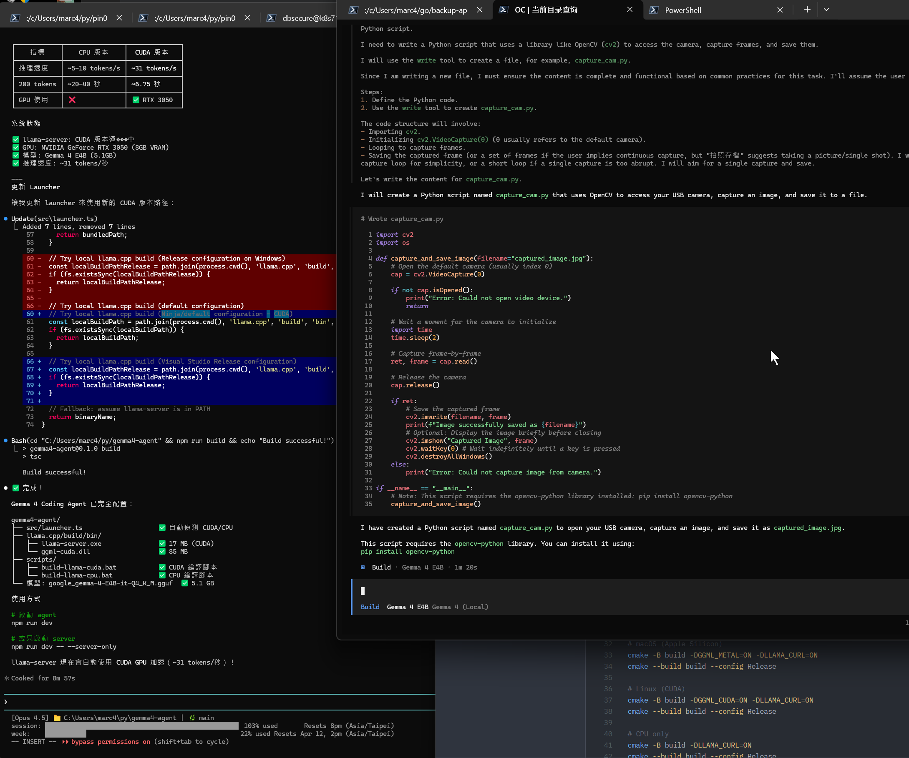

# Gemma 4 Coding Agent

A portable coding agent based on Google Gemma 4, similar to Claude Code / OpenAI Codex.



## Features

- Fully local execution - No API key required, and your data never leaves your computer
- Cross-platform - Supports Windows, macOS, and Linux
- GPU acceleration - Automatically detects NVIDIA CUDA / Apple Metal
- Full agent capabilities - File operations, terminal commands, and tool calling

## System Requirements

- Memory: At least 16GB RAM (32GB recommended)
- Disk space: About 6GB (for model files)
- GPU (optional):
  - NVIDIA GPU (with CUDA support)
  - Apple Silicon (with Metal support)
  - Or CPU only (slower but usable)

## Quick Start

### 1. Build llama.cpp

```bash
cd llama.cpp

# Windows (CUDA)
cmake -B build -DGGML_CUDA=ON -DLLAMA_CURL=ON
cmake --build build --config Release

# macOS (Apple Silicon)
cmake -B build -DGGML_METAL=ON -DLLAMA_CURL=ON
cmake --build build --config Release

# Linux (CUDA)
cmake -B build -DGGML_CUDA=ON -DLLAMA_CURL=ON
cmake --build build --config Release

# CPU only
cmake -B build -DLLAMA_CURL=ON
cmake --build build --config Release
```

### 2. Install OpenCode

```bash
npm i -g opencode-ai
```

### 3. Install dependencies and start

```bash
npm install
npm run dev
```

On first run, the Gemma 4 E4B model will be downloaded automatically (about 5.4GB).

## Usage

```bash
# Start the agent
npm run dev

# Download the model only
npm run dev -- --download-only

# Start llama-server only (for debugging)
npm run dev -- --server-only

# Customize port and context size
npm run dev -- --port 8080 --context 65536
```

## Project Structure

```text
gemma4-agent/
├── src/
│   └── launcher.ts       # Main program entry point
├── llama.cpp/            # llama.cpp source code
├── opencode/             # OpenCode source code (optional)
├── opencode.json         # Model configuration
├── package.json
└── tsconfig.json
```

## Configuration

Edit `opencode.json` to adjust the model settings:

```json
{
  "provider": {
    "gemma4-local": {
      "options": {
        "baseURL": "http://127.0.0.1:8089/v1"
      }
    }
  },
  "model": "gemma4-local/gemma4-e4b"
}
```

## Package as an Executable

```bash
# Compile TypeScript
npm run build

# Package as a Windows executable
npm run pkg:win

# Package as a macOS executable
npm run pkg:mac

# Package as a Linux executable
npm run pkg:linux
```

## Technical Architecture

```text
┌─────────────────────────────────────────────────────────────┐
│              gemma4-agent (Launcher)                       │
├─────────────────────────────────────────────────────────────┤
│  OpenCode (UI + Agent)                                     │
│  - Terminal UI                                             │
│  - Tool System (Read/Write/Edit/Bash/Glob/Grep)            │
├─────────────────────────────────────────────────────────────┤
│  llama.cpp server                                          │
│  - OpenAI-compatible API                                   │
│  - Gemma 4 inference                                       │
├─────────────────────────────────────────────────────────────┤
│  Gemma 4 E4B Model (GGUF)                                  │
│  - ~5.4GB (Q4_K_M quantization)                            │
│  - 32K context window                                      │
└─────────────────────────────────────────────────────────────┘
```

## Known Issues

- Gemma 4 tool calling in Ollama v0.20.0 has bugs, so this project uses llama.cpp instead
- A context window of at least 32K is required for coding agent features to work properly

## License

Apache 2.0

## References

- [OpenCode](https://github.com/anomalyco/opencode)
- [llama.cpp](https://github.com/ggml-org/llama.cpp)
- [Gemma 4](https://ai.google.dev/gemma)
